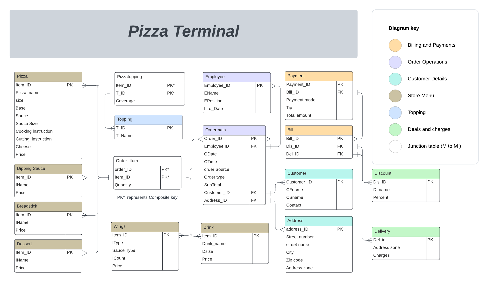

# Pizza Terminal Database

## Overview

The Pizza terminal database is a project to explore and apply fundamental concepts of database management systems (DBMS). It simulates a simplified system for managing a pizza restaurant, encompassing various aspects such as customer orders, ingredients inventory, delivery tracking, and employee management.
## Project Schema

## Purpose

The purpose of this project is to gain practical experience in database design, implementation, and management. By working with the Pizza terminal database, users can:
- Understand the principles of entity-relationship modelling and normalization.
- Practice writing SQL queries for data retrieval, insertion, updating, and deletion.
- Explore concepts such as indexing, transactions, and concurrency control.
- Experiment with real-world scenarios to optimize database performance and ensure data integrity.

## Important Lessons to be Learned

During the development of the Pizza_terminal database project, several key lessons were learned:
- **Managing Many-to-Many Relationships**: Understanding how to manage many-to-many relationships between tables, such as the relationship between pizzas and ingredients.
- **SQL vs. NoSQL**: Recognizing the limitations of SQL and when NoSQL databases become relevant, especially for semi-structured data where flexibility in schema design is required.
- **Query Execution Sequence**: Learning the sequence of executing SQL queries and the importance of clauses like SELECT, FROM, WHERE, GROUP BY, HAVING, and ORDER BY.
- **Join Selection**: Gaining insights into selecting the appropriate type of JOIN operation to retrieve data efficiently, balancing between performance and accuracy.
- **Data Generation and Importing**: Understanding the importance of careful data generation and importing into tables, ensuring data consistency, integrity, and performance. At the same time, taking care of normalization in relations.

## A Key Usage of this Database

This dataset is well-suited for learning data visualization techniques. With diverse information on pizza orders, customer details, and payment methods, it offers ample opportunities to explore visualization tools and methods. From visualizing order trends to analyzing customer demographics, this dataset provides a rich source for practicing various data visualization techniques effectively.

## Methodology

### 1. Understanding Requirements:
Understanding the requirements of the Pizza_terminal database begins with determining the optimal table structure to effectively capture all necessary information. This process involves researching various pizza store operations to identify common data points and functionalities. By studying existing pizza store databases and meeting with experienced personnel in the industry, insights can be gained into the typical data entities and their relationships. Conversations with staff members who work directly with the system provide invaluable perspectives on the day-to-day operations, including customer order management, ingredient inventory tracking, and employee scheduling. Through this research and consultation process, it becomes apparent how many tables should be included in the database schema and what ideal data types should be used for each attribute. This comprehensive understanding of requirements lays the foundation for designing a database that accurately reflects the needs and workflow of a pizza restaurant.

### 2. Database Design:
Once the basic plan for the Pizza_terminal database is established, the next step is to create a detailed relational schema using tools like Lucid chart. This involves mapping out the entities, their attributes, and the relationships between them in a visual format. By meticulously designing the schema, it becomes easier to ensure data integrity, minimize redundancy, and optimize query performance.

After finalizing the relational schema, the next step is to translate it into a physical database by implementing it in MySQL. This is achieved by executing the "Schema.sql" file, which contains SQL commands to create the necessary tables, define relationships using foreign keys, and set up constraints to enforce data integrity. 

### 3. Artificial Data Generation:
The artificial data generation process for the Pizza_terminal database involves several steps to populate the tables with realistic data:
1. **Executing SQL Files**: Start by executing the "Data1.sql" and "Data2.sql" files, which contain data for tables like toppings, discounts, delivery details, etc.
2. **Setting up Python Environment**: Install necessary libraries like numpy, pandas, random, CSV, faker, and MySQL in a Python environment.
3. **Running Python Scripts**: Execute a series of Python scripts in the following sequence:
   - Pizza_data_generator.py: Generate data for pizza-related tables.
   - PZData_cleaning.py: Perform data cleaning tasks.
   - Pizzatoping_generator.py: Generate data for pizza toppings.
   - Fake_address.py: Generate fake addresses.
   - Customer_detail.py: Generate customer details.
   - OrderItem.py: Generate order items.
   - Bill_Data.py: Generate bill data.
   - Payment_Data.py: Generate payment data.
   - Ordersmain.py: Generate main order details.
   - Orderitem2.py: Generate additional order items.

4. **Data Import and Refinement**:
   Once each Python script has generated or refined the data, it is saved into CSV files. These CSV files are then utilized to import the data into the MySQL database using MySQL's built-in functions. During the import process, specific columns are handled to ensure data consistency:
   - **Payment Table**: When importing data for the Payment table, the subtotal column is left unchecked. 
   - **Order main table**: the subtotal column in the Order main table is left unchecked. 
   - **Bill table**: the del_id column is unchecked. 

5. **Handling Foreign Key Constraint Error**: When importing order item data, you may encounter a foreign key constraint error (error 1520). To resolve this, turn off foreign key checks by running the OI.py file.

6. **Final SQL Steps**: Execute three SQL files in sequence:
   - Subtotal_Price.sql: Update subtotal prices.
   - Bill_Del_ID.sql: Update bill details.
   - PAYMENT_TA.sql: Update payment details.

Following these steps ensures that the Pizza_terminal database is populated with artificial but realistic data, ready for querying and other operations. This process mimics real-world scenarios and helps in testing the database's functionality and performance.

### 4. Querying and Optimization:
Once the database is implemented, the focus shifts to querying and optimization. This involves writing SQL queries to retrieve, insert, update, and delete data. It also involves optimizing queries for performance by creating indexes, analyzing query execution plans, and considering factors such as data distribution and cardinality.

